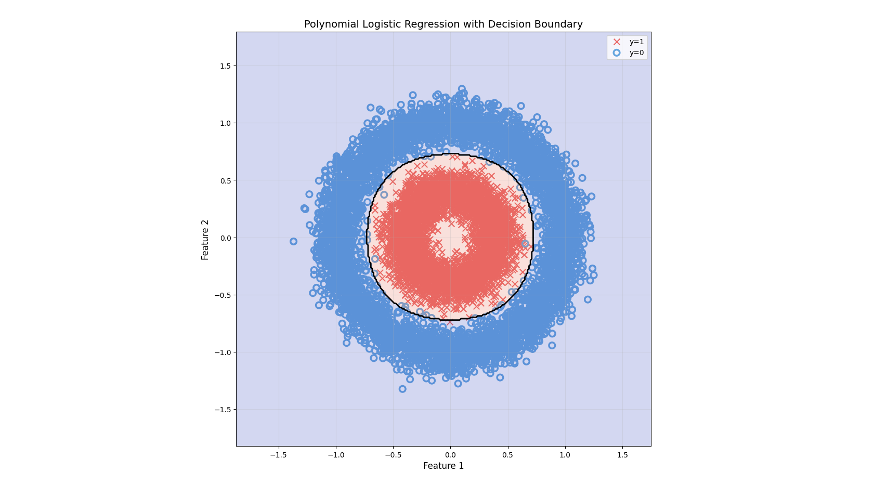
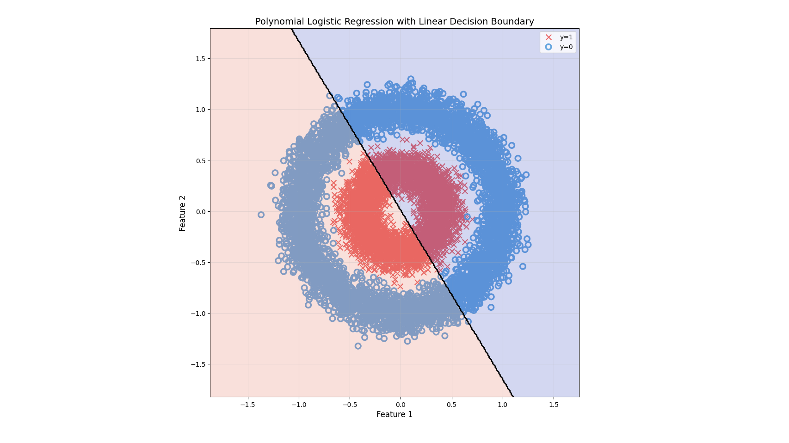

# Polynomial Logistic Regression Model 📈

A compact, educational example of using polynomial features with logistic regression to learn a nonlinear decision boundary.

## Overview 🌟

This project shows how a standard logistic regression model can be made more expressive by transforming the input features into polynomial terms. The goal is not to model a real-world dataset, but to learn how a higher-order polynomial transformation can help separate classes when the data is not linearly separable.

The model is trained on a synthetic toy dataset stored in [nonlinear_data.csv](nonlinear_data.csv). Each row contains:

- two feature columns: x1 and x2
- a binary label: 0 or 1

Because the data is intentionally nonlinear, a simple straight-line boundary is not enough. By introducing polynomial features, the model can learn a curved decision boundary that is much more suitable.

## What this project demonstrates 🧠

- how to load and inspect a small classification dataset
- how to split data into training and test sets
- how polynomial feature engineering works
- how scikit-learn pipelines combine preprocessing and modeling steps
- how to visualize the decision boundary learned by the model

## Why polynomial features help 🔧

In ordinary logistic regression, the model learns a decision boundary of the form:

$$
P(y=1) = \sigma(w_0 + w_1x_1 + w_2x_2)
$$

That means the boundary is always linear in the original feature space.

With polynomial features, we add terms such as:

- $x_1^2$
- $x_2^2$
- $x_1x_2$

This gives the model more flexibility. In other words, the model is no longer restricted to a straight line and can learn a curved boundary.

## How scikit-learn is used 🛠️

This example uses scikit-learn in a very straightforward way:

1. `PolynomialFeatures(degree=4)` creates new input features by combining the original ones into polynomial terms.
2. `LogisticRegression()` is then trained on these transformed features.
3. The two steps are wrapped in a `Pipeline`, which makes the workflow clean and easy to manage.

A typical pipeline looks like this:

```python
from sklearn.pipeline import Pipeline
from sklearn.preprocessing import PolynomialFeatures
from sklearn.linear_model import LogisticRegression

model = Pipeline([
    ("poly", PolynomialFeatures(degree=4, include_bias=False)),
    ("logreg", LogisticRegression(max_iter=1000))
])
```

This is educational because it shows the core idea behind feature engineering: instead of changing the learning algorithm itself, we change the input representation so the model can represent more complex patterns.

### A useful intuition about the feature count 📐

If you start with 2 original features, $(x_1, x_2)$, and create polynomial terms up to degree 6, the number of feature terms grows quickly.

- Exactly degree 6: $\binom{2+6-1}{6} = \binom{7}{6} = 7$
- Degrees 1 through 6 (the usual choice): $\sum_{k=1}^{6} \binom{2+k-1}{k} = 2 + 3 + 4 + 5 + 6 + 7 = 27$
- Including the constant term: $27 + 1 = 28$

So, even with only two original variables, a 6th-degree expansion creates a much richer feature space that gives the model more flexibility to fit curved boundaries.

## Example output 📊

The script prints the model accuracy on both the training and test sets and displays a plot of the learned decision boundary.





*Figure: With degree 1, the model is forced to use a straight-line boundary, which is too simple for this nonlinear dataset.*

When the polynomial degree is reduced to 1, the model is forced to learn a straight-line decision boundary. In this case, the boundary is too simple and does not fit the curved structure of the data well, which is why the separation looks poor.

## Files 📁

- [polynomial_logistic_regression_model.py](polynomial_logistic_regression_model.py) — main script that trains the model and generates the plot
- [nonlinear_data.csv](nonlinear_data.csv) — synthetic dataset used for learning
- [images](images) — folder for saved figures and outputs

## How to run ▶️

From the project folder, run:

```bash
python polynomial_logistic_regression_model.py
```

## Notes ✨

This dataset is intentionally synthetic and designed for learning purposes. It is useful for understanding how polynomial terms can help logistic regression model nonlinear relationships.

If you want to explore further, try changing the polynomial degree to see how the decision boundary changes.
